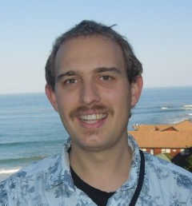
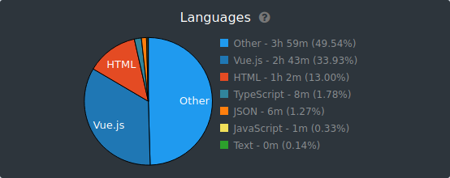
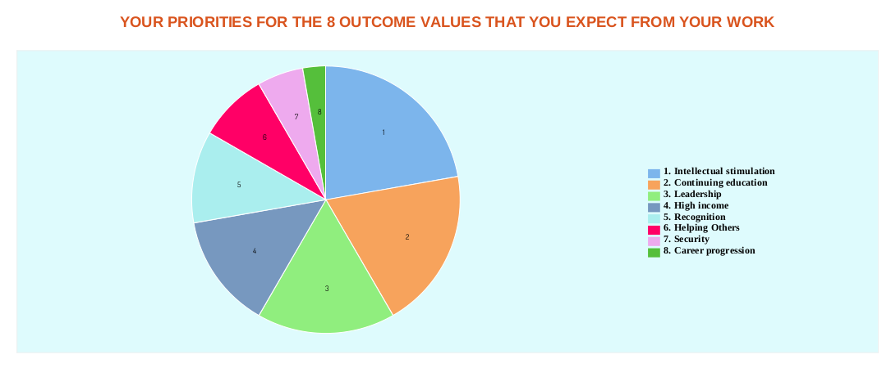

# About page
Hi My name is Barco van Rhijn. 

I'm a Freelance Developer that's able to speak geek and human fluently. My Consultative approach is rated highly with customers I do work for. 

If your looking for a Developer I'm available for hire. You can reach out to me on barcovanrhijn@gmail.com

You can view some of my spare time projects on my Github page https://github.com/barcovanrhijn. 

I often post some insights gleaned from paid work on this blog. 

## Skills
My strongest skills are
- PHP
- JS 
- CSS3
- SASS
- Project management
- Communication

Much of time spent expanding skills is invested in expanding my JS skillset. This particular snapshot from February 2021 also includes some time spent coding out Email templates.

## I've used 
- PHP (Vanilla)
- Laravel
- Mysql/MariaDb
- Python3
- Bash
- JS (Vanilla)
- VueJs 
- ReactJs 
- NodeJs 
- CSS3
- SASS
- Bootstrap
- Ionic (Android & PWA is my current focus)
- TypeScript 

# Values

